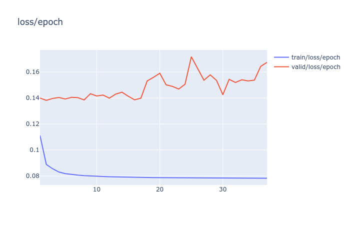

# THIS IS AN INCOMPLETE PROJECT

# Make Sure AVSPEECH dataset is in data/audio\_visual/ folder

## Download the video dataset
### This can take a long time, you can stop downloading after few files have been downloaded by sending ^C

```bash
cd src/loader
```

```bash
python3 download.py
```

## Extract sound from the video

Video length can be more than 3 seconds. Hence, extract multiple audio from a single video file.
```bash
python3 extract_audio.py
```

## Mix the audio

Synthetically mix clean audio. This can take a lot of space of the disk. 96Kb approx for each file.
Total number of files can be: <sup>total_files</sup>C<sub>input_audio_size </sub> for each train and val.
```bash
python3 audio_mixer_generator.py
```

## Remove empty audio

Generating lots of synthetically mixed audio (100+ per second) generates a lot of empty audio files.
Hence, we need to remove the empty audio files.
```bash
python3 remove_empty_audio.py
```

## Convert the path inside the generated dataframe

Path changes from src and src/loader. Both directory has files that need to manipulate
the data/ directory. Hence, create a copy with the correct path in src/loader/
```bash
python3 transform_df.py
```

## Run to cache all embeddings

Create video embedding from all the video files. This will also store video which 
are corrupted. Corrupted video include where face was not detected.
```bash
python3 generate_video_embedding.py
```

## Remove corrupt frames

Hence, remove corrupted video frames as well.
```bash
python3 remove_corrupt.py
```

## Run to cache all spectrograms

Cache, all the spectrograms
This takes a lot of memory. Tens/Hundreds of GB
```bash
python3 convert_to_spec.py
```

## Train the model
#### VRAM usage is very high (batch size of 2 requires 3+ GB)
```bash
python3 train.py --bs 20 --workers 4 --cuda True
```

# Results

### Example Prediction after 37 epochs (Suffering from overfitting)


### Loss Plot


### SNR Plot

