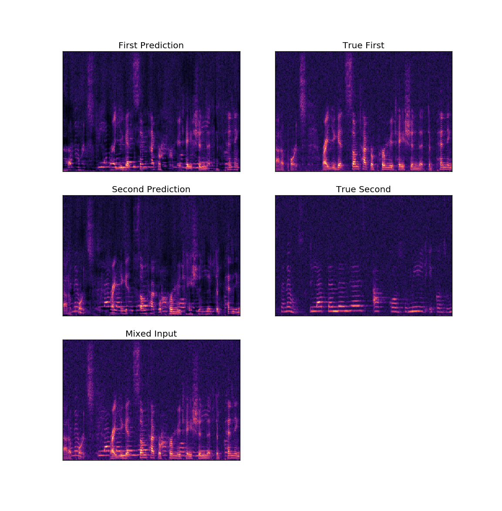

# THIS IS AN INCOMPLETE PROJECT

# Make Sure AVSPEECH dataset is in data/audio\_visual/ folder

## Download the video dataset
### This can take a long time, you can stop downloading after few files have been downloaded by sending ^C

```bash
cd src/loader
```

```bash
python3 download.py
```

## Extract sound from the video

```bash
python3 extract_audio.py
```

## Mix the audio

```bash
python3 audio_mixer_generator.py
```

## Convert the path inside the generated dataframe
```bash
python3 transform_df.py
```

## Run to cache all embeddings
```bash
python3 generate_video_embedding.py
```

## Remove corrupt frames
```bash
python3 remove_corrupt.py
```

## Run to cache all spectrograms
```bash
python3 convert_to_spec.py
```

## Train the model
#### VRAM usage is very high (batch size of 2 requires 3+ GB)
```bash
python3 train.py --bs 20 --workers 4 --cuda True
```

# Results

### Example Prediction after 37 epochs (Suffering from overfitting)


### Loss Plot


### SNR Plot

